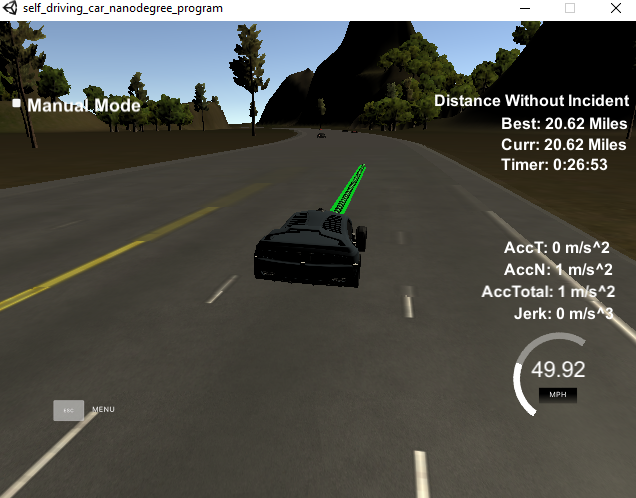

# Model Documentation

In the following I will elaborate on the points of the project rubric and decribe my model.

## Project Rubric Points

### **The code compiles correctly**
The compilation with `cmake` does not return any errors on WSL. There were no changes to the configuration file. The header file `spline.h` was added to the source-directory of the project.

### **The car is able to drive at least 4.32 miles without incident..**
I ran the simulator for a distance of 10 miles without experiencing any incident. 

### **The car drives according to the speed limit.**
The desired speed in free floating traffic is set in line 157 of *main.cpp* to `max_speed = 49.95 mph`. During the test runs of the program, no speed limit violation was observed.

### **Max Acceleration and Jerk are not Exceeded.**
The speed increments when adapting the speed are defined by the variable set in line 158 of *main.cpp* to  `max_acc = 0.224`. If the car drives below the defined maximum speed, the speed is incremented with this value and therefore does not exceed the limits of acceleration and jerk.

### **Car does not have collisions**
No collisions.

### **The car stays in its lane, except for the time between changing lanes.**
The car does a pretty good job of staying in the lane, although it sometimes swerves a tiny bit out of the center of the lane. However, it never leaves the lane markings.

### **The car is able to change lanes**
The car is able to perform lane changes to the left if there is slower vehicle in front and the traffic situation allows for a safe lane change, i.e. the adjacent lanes is free of other vehicles within 30 meters in front and behind the ego vehicle.

### **There is a reflection on how to generate paths.**

The path planning is implemented in *main.cpp* from line 118 to 294.
The code can be subdivided into three sections:

* Reading and interpreting sensor fusion data for predicting the other vehicles future states
* Behavior Planning for the ego vehicle
* Planning the path / trajectory

### Section 1: Sensor fusion data (line 122 to 150)
In this section, the sensior fusion data provided by the simulator are processed in order to have an understanding of the world around the vehicle. The data provided by the simulator are used for

* Calculating the speed magnitude and the lane of each traffic object (TO) on the right-hand side of the highway. 
* The speed of each TO is used to predict its future s-position
* It is determined if the future s-position of another TO is within 30 meters ahead on the same lane or within 30 meters ahead **or** behind on the adjacent lanes.

These information are stored and given to the behaviour planning section.

### Section 2: Behaviour planning (line 156 to 177)
In this section, the actions of the ego vehicle are set based on the inputs from the prediction. This means that the decision is made

 * whether or not to change the lane
 * wheter or not to adjust the speed

 If there is no other TO in front of ego, then the middle lane is chosen. If there is another TO on the ego lane that is driving slower, then the logic determines if a lane change is possible. If there is no TO on the adjacent (target) lane within a distance (front or back) of 30 m to the ego, the lane change is considered safe and should be exectued. If a lane change is not possible, then the speed should be adjusted so that the ego always keeps a safe distance of 30 meters to the TO in front.

### Section 3: Trajectory planning (line 188 to 296)
Based on the output from the behaviour planning, this section sends a path to the simulator. Since the points in the path are visited every 0.02 sec, this path also contains time information and can therefore also be seen as trajectory.

This section is an implementation of the concept presented in the Q&A session of the course.
The steps are as follows:

* First some reference points from the old path are created to make the first points of the new path tangent to the old one. If no old path exists, e.g. at the drive-off the current position of the ego vehicle is taken (lline 187 to 223)
* New waypoints are created in 30, 60, 90 meters distance in s-direction. Besides the road layout, these points depend on the future lane and therefore incorporate the input from the behaviour planning. (line 226 to 236)
* A transofrmation to the local ego vehicle coordinate system is performed, which makes the calculation of the new path points more easy. The new path points are calculated using `spline.h` and the waypoints in 30, 60 and 90 meters. At this point, the desired new speed from the behaviour section is used to calculate the correct point spacing. (line 238 to 282)
* Finally, the coordinates in the path are re-transformed to the global x,y coordinate system and pushed to the vector that is send to the simulator (line 284 to 296)

